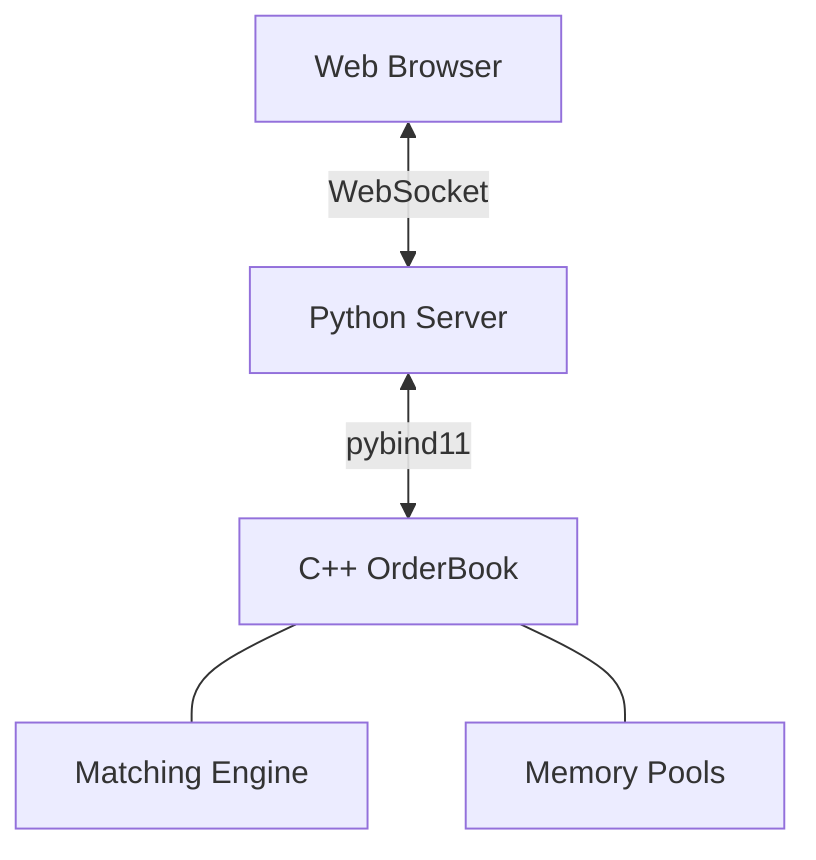

# Low-Latency Limit Order Book

A high-performance trading engine combining **C++20 speed** with **Python flexibility**.


## 🚀 Overview

This project implements a **hybrid trading architecture**:
1.  **Core Engine (C++)**: Handles order matching and memory management with sub-microsecond latency.
2.  **Interface (Python)**: Manages WebSocket connections and broadcasts market data.
3.  **Bridge (pybind11)**: Connects the two worlds with near-zero overhead.

## 🏗️ Architecture



## 🛠️ Quick Start

### 1. Prerequisites
*   Windows (MinGW-w64) or Linux/macOS
*   Python 3.12+
*   CMake 3.20+

### 2. Run the System
We have simplified the startup into two commands.

**Terminal 1: Start the Backend**
```powershell
python web/server/websocket_server.py
```

**Terminal 2: Start the GUI**
```powershell
python web/serve_gui.py
```

**Open Browser:** Go to `http://localhost:8082`

## 📦 Build Instructions (If modifying C++)

If you change the C++ code, rebuild the bindings:

```powershell
# 1. Configure
cmake -G "MinGW Makefiles" -B build -S . -DPython3_EXECUTABLE="C:\Python312\python.exe" -DBUILD_PYTHON_BINDINGS=ON

# 2. Build
cmake --build build --target lob_py --config Release

# 3. Deploy
copy build\python\lob_py.cp312-win_amd64.pyd web\server\lob_py.pyd
copy C:\ProgramData\mingw64\mingw64\bin\libgcc_s_seh-1.dll web\server\
copy C:\ProgramData\mingw64\mingw64\bin\libstdc++-6.dll web\server\
copy C:\ProgramData\mingw64\mingw64\bin\libwinpthread-1.dll web\server\
```

##  Future Roadmap

*   **Pure C++ Server**: Removing Python entirely for raw wire-to-wire speed.
*   **FIX Protocol**: Adding institutional connectivity.
*   **FPGA**: Hardware acceleration support.

## 📄 License
MIT License
